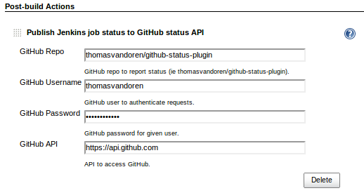
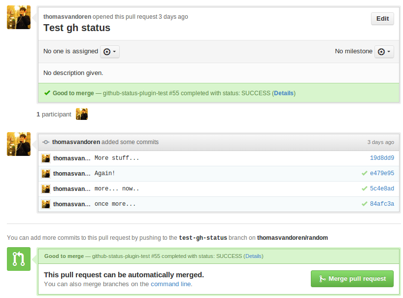

github-status Jenkins plugin
============================

Publish build statuses to GitHub Status API.

[](https://travis-ci.org/thomasvandoren/github-status-plugin)

This is a [Jenkins ruby plugin](https://github.com/jenkinsci/jenkins.rb).

Install
-------

Install from the [GitHub Status Plugin] from your Jenkins' plugin management center.

FIXME: Add screen shot. (thomasvandoren, 2013-04-30)

### From Source

To create the HPI from source, run:

```bash
rake package
```

Copy the pkg/github-status.hpi to $JENKINS_HOME/plugins directory and restart jenkins.

Or, use the plugin management console (http://your-jenkins:8080/pluginManger/advanced) to upload pkg/github-status.hpi. Restart jenkins when the upload is finished.

Configure
---------

With the plugin installed, select "Publish Jenkins job status to GitHub" from the publish menu in the project configuration.


Enter the GitHub repo in the form owner/repo_name that the project uses. Enter a username/password that has permissions to comment on commits. The default API URL is correct for GitHub. A different value will be required for GitHub Enterprise.



GitHub commits will now be marked with the Jenkins build status. The status shows up in pull requests, the branches view, and next to commits.



Background
----------

The [GitHub plugin](https://wiki.jenkins-ci.org/display/JENKINS/GitHub+Plugin) supports this functionality. That plugin is restricted to projects that are configured to use the github remote directly.

If mirrors are used, the GitHub plugin will not work. This plugin *works with mirrors* by separating the github configuration from the source control configuration. It is up to the user to ensure commits existing in the build also exist on github.

Security
--------

As of 2013-04-30, the password is stored in clear text in the job config.xml. It should go somewhere more secure. [Issue #5](https://github.com/thomasvandoren/github-status-plugin/issues/7) on GitHub is tracking this issue.

Development
-----------

* Install [JRuby](http://jruby.org/).
* Install the gem dependencies and run the server:

```bash
bundle install
rake server
```

Testing
-------

To run the [RSpec](http://rspec.info/) tests:

```bash
rake spec
```

License
-------

BSD

Authors
-------

Thomas Van Doren
